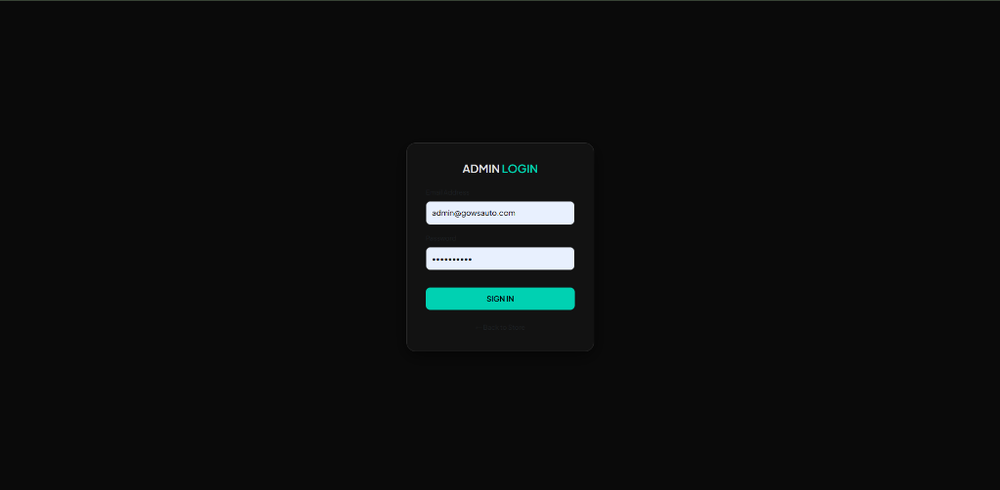
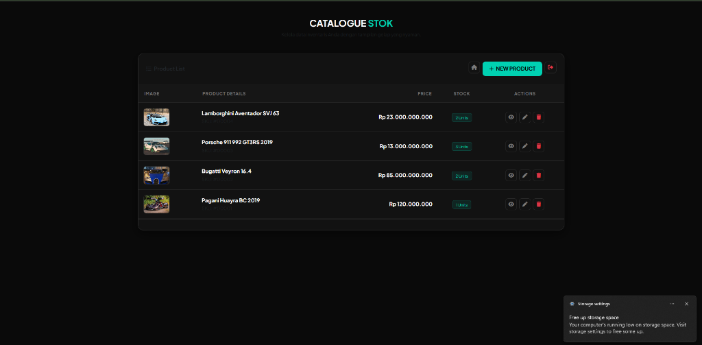
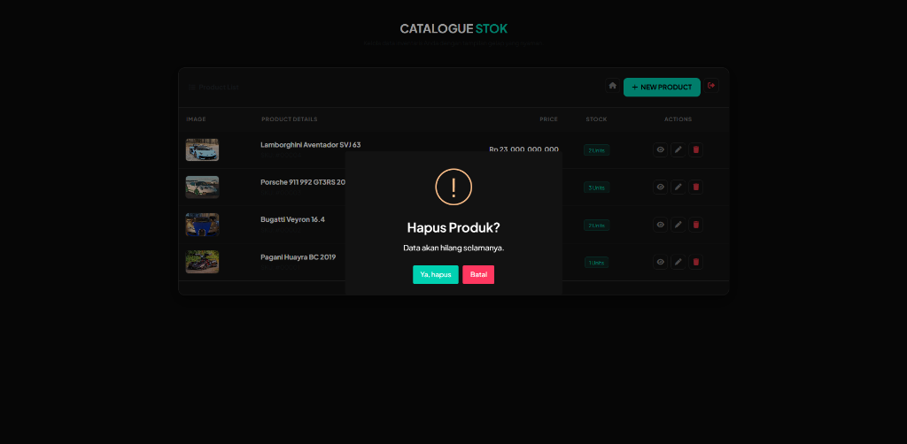
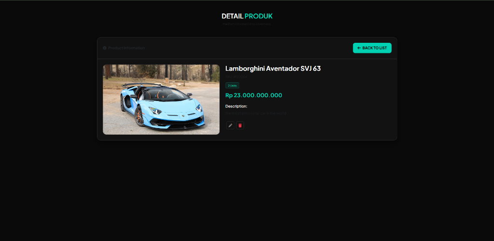
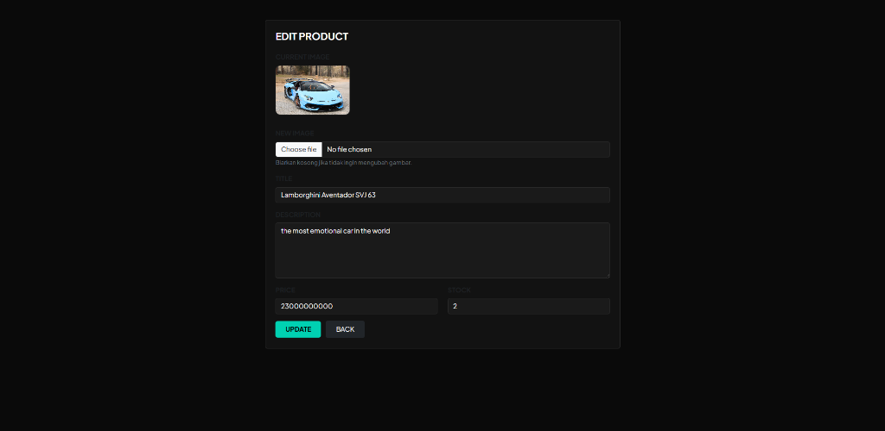

# Gows Auto - Premium Showroom & Inventory Management System

Gows Auto adalah aplikasi web katalog showroom mobil mewah (e-commerce catalog) yang dibangun menggunakan Laravel. Aplikasi ini dirancang dengan antarmuka bertema gelap (Dark UI) yang modern, bersih, dan mewah menggunakan Bootstrap 5 dan gaya custom CSS.

---

## 📌 Deskripsi Web

Gows Auto berfungsi sebagai platform pameran (showroom) kendaraan bermotor mewah. Pengunjung web dapat melihat detail unit mobil yang tersedia, mengecek spesifikasi lengkap, melihat harga serta sisa stok, dan melakukan pembelian langsung yang terintegrasi ke WhatsApp Admin dengan template pesan otomatis yang dinamis.

---

## 📸 Tampilan Aplikasi (Screenshots)

Berikut adalah beberapa tampilan halaman dari Gows Auto:

### 1. Halaman Login Admin


### 2. Dashboard Daftar Produk


### 3. Konfirmasi Hapus Produk (SweetAlert2)


### 4. Detail Produk (Halaman Preview)


### 5. Form Edit Produk


---

## 🛠️ Sistem Manajemen (Admin Dashboard)

Aplikasi dilengkapi dengan panel admin untuk mengelola katalog produk. Fitur-fitur utama di dalamnya meliputi:
- **Authentication**: Keamanan akses halaman admin menggunakan sistem Login & Logout Laravel.
- **Product Management (CRUD)**:
  - **Create**: Menambahkan unit produk baru lengkap dengan judul, deskripsi rinci, harga, stok, dan gambar.
  - **Read**: Menampilkan daftar produk dalam bentuk tabel admin interaktif dengan pagination. Detail produk dapat dilihat secara utuh melalui halaman *Preview*.
  - **Update**: Memperbarui informasi produk termasuk mengganti gambar produk yang ada.
  - **Delete**: Menghapus produk dari database beserta file gambar fisiknya di storage server.
- **Interactive UI**: Menggunakan SweetAlert2 untuk konfirmasi penghapusan data secara interaktif dan menampilkan notifikasi aksi sukses.

---

## 🔐 Cara Login Admin

Untuk masuk ke halaman dashboard admin:
1. Akses halaman login melalui url: `/login` atau klik tombol **Admin Panel** pada navigasi atas di landing page.
2. Gunakan kredensial default bawaan database seeder berikut:
   - **Email / Username**: `admin@gowsauto.com`
   - **Password**: `password`

---

## 🗄️ Rancangan Database

Database menggunakan **SQLite** (menggunakan file database bernama `laravel` di root project secara default, atau dapat diarahkan ke `database/database.sqlite`).

### 1. Tabel `users` (Data Akun Admin)
Menyimpan informasi admin yang memiliki otorisasi masuk ke Dashboard.

| Kolom | Tipe Data | Keterangan |
|---|---|---|
| `id` | BigInt (PK) | Auto-increment primary key |
| `name` | String | Nama lengkap user / admin |
| `email` | String (Unique) | Alamat email (digunakan untuk login) |
| `email_verified_at` | Timestamp | Waktu konfirmasi email (nullable) |
| `password` | String | Hash password akun |
| `remember_token` | String | Token sesi login otomatis (nullable) |
| `created_at` | Timestamp | Waktu data dibuat (nullable) |
| `updated_at` | Timestamp | Waktu data diperbarui (nullable) |

### 2. Tabel `products` (Data Katalog Produk)
Menyimpan data detail unit kendaraan/mobil yang dipajang di katalog.

| Kolom | Tipe Data | Keterangan |
|---|---|---|
| `id` | BigInt (PK) | Auto-increment primary key |
| `image` | String | Nama file gambar produk yang diunggah |
| `title` | String | Judul atau nama produk / mobil |
| `description` | Text | Deskripsi spesifikasi dan ulasan detail unit |
| `price` | BigInt | Harga unit dalam mata uang Rupiah |
| `stock` | Integer | Jumlah unit stok yang tersedia (default: `0`) |
| `created_at` | Timestamp | Waktu data dibuat (nullable) |
| `updated_at` | Timestamp | Waktu data diperbarui (nullable) |

---

## 🚀 Cara Menjalankan Aplikasi di Lokal

Ikuti langkah-langkah di bawah ini untuk menjalankan aplikasi Gows Auto di server lokal Anda:

### 1. Prasyarat (Prerequisites)
Pastikan server lokal Anda telah terpasang:
- PHP >= 8.2 (dengan extension PDO SQLite enabled)
- Composer
- Node.js & NPM

### 2. Instalasi Dependensi
Jalankan perintah berikut di terminal untuk memasang library PHP dan Node.js:
```bash
# Pasang dependensi PHP (Laravel)
composer install

# Pasang dependensi JavaScript
npm install
```

### 3. Konfigurasi Environment File
Salin file konfigurasi lingkungan `.env`:
```bash
cp .env.example .env
```
Secara default aplikasi menggunakan SQLite. Buka file `.env` baru Anda dan pastikan setelan database diarahkan ke SQLite:
```env
DB_CONNECTION=sqlite
DB_DATABASE=laravel
```
*(Catatan: File database sqlite bernama `laravel` sudah tersedia di folder root project. Jika file belum ada, Anda bisa membuatnya sendiri di root).*

Lalu generate Application Key Laravel:
```bash
php artisan key:generate
```

### 4. Jalankan Migrasi dan Database Seeder
Jalankan perintah berikut untuk membuat struktur tabel dan mengisi data admin default:
```bash
php artisan migrate --seed
```

### 5. Jalankan Storage Link
Buat symlink agar gambar produk yang disimpan di storage server dapat diakses secara publik oleh web browser:
```bash
php artisan storage:link
```

### 6. Jalankan Server Lokal
Jalankan Laravel development server dan compiler aset frontend:

```bash
# Terminal 1: Jalankan Web Server Laravel
php artisan serve

# Terminal 2: Jalankan Vite compiler aset frontend
npm run dev
```

Buka browser Anda dan akses aplikasi melalui alamat: **`http://127.0.0.1:8000`**.
